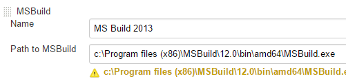
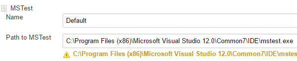
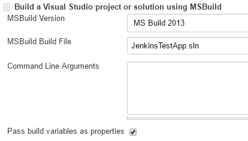
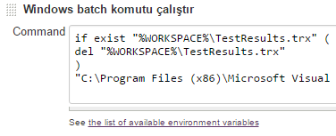
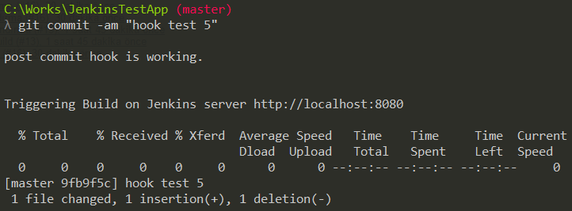

### Jenkins ile CI ###

Jenkins kurulur: https://jenkins.io/

Remote ya da lokal bir git repo oluşturulur.

Jenkins kurulumu yapıldıktan sonra, (Asp.net mvc projesi için) gerekli 3 temel plug-in'i kurulumu yapılır. (Ana sayfa / jenkins'i yönet / eklentiler).

1. MSBuild : projeyi Jenksin'in otomatize olarak derleyebilmesi için
2. Git (Bitbucket) : git entegrasyonu
3. MSTest Plugin : unit test sonuçlarını görselleştirebilmek için

Ana sayfa / jenkins'i yönet / Sistem Konfigürasyonunu Değiştir üzerinden, kurduğumuz eklentiler için gerekli ayarları yapıyoruz

1. MSBuild için makinede bulunan MSBuild.exe yolunu belirtiyoruz. VS2013 için c:\Program files (x86)\MSBuild\12.0\bin\amd64\MSBuild.exe şeklinde olmaktadır. Küçük bir uyarı mesajı ile karşılaşılıyor, önemsizdir.



2. Build ettikten sonra Unit testleri çalıştırıp sonuçlarını Jenkins üzerinden görselleştirebilmek için kullandığımız MSTest Plugin için MSTest.exe yolunu vermemiz gerekli. VS 2013 için şu şekildedir. C:\Program Files (x86)\Microsoft Visual Studio 12.0\Common7\IDE\mstest.exe



Genel ayarları yaptıktan sonra ilk örnek CI projesini oluşturabiliriz.

Ana sayfada "Yeni Item" ekranından uygun bir isim vererek
"Serbest-stil yazılım projesi yapılandır" şeklinde projeyi oluşturuyoruz. 

Proje dash-board üzerinden "Konfigürasyonu Düzenle" ekranında gerekli build adımlarını oluşturacağız. 

1. Kaynak Kodu Yönetimi kısmından Git seçilerek repo url'ini veriyoruz. Build etmeden önce Jenkins tüm kodu bu repo üzerinden çekecek (checkout).

2. Yapılandırma (Build) adımları tanımlamamız gerekli. 

2.1 Öncelikle MSBuild adımı ekleyip MSBuild File olarak proje solution dosyasını veriyoruz.


	
2.2 Solution (içindeki UnitTest gibi diğer tüm projeler ile birlikte) yukarıdaki adımla derlenecek. Daha sonra unit testleri çalıştırmak için bir windows batch komutu çalıştırıyoruz. Bunun için Yapılandırma adımı olarak "Windows batch komutu çalıştır"ı ekliyoruz. 

```
if exist "%WORKSPACE%\TestResults.trx" (
del "%WORKSPACE%\TestResults.trx" 
)
"C:\Program Files (x86)\Microsoft Visual Studio 12.0\Common7\IDE\mstest.exe" /resultsfile:"%WORKSPACE%\TestResults.trx" /testcontainer:"%WORKSPACE%\UnitTests\bin\Debug\UnitTests.dll" /nologo
```



2.3 MSTest.exe aracı, test sonuçlarını TestResults.trx isimli bir dosyaya çıktı olarak verecek. Ancak Jenkins bu formatı anlamadığı için bir dönüşüm yapmak gerekli. Bunun için yapılandırma sonrası adımı ekliyoruz. Publish MSTest test result rerport.

Test report trx file için TestResults.trx dosyasını giriyoruz. 

Tüm işlemleri "Kaydet" ile kaydediyoruz.

"Şimdi Yapılandır" ile anında projeyi derleyip sonuçları göreibliriz. 

Tam otomatizasyonu sağlamak için git 'e commit edildiğinde Jenksin'in tüm derleme adımlarını çalıştırmasını isitoyruz. 

Bunun için git üzerinde bir hook oluşturarak verilen komutların committen sonra çalıştırılmasını sağlayacağız. 

{proje_yolu}/.git/hooks

altında "post-commit" isimli uzantısız bir dosya oluşturuyoruz. 

```
#!/bin/sh

# Remember to point this to the correct url and port number! 
JenkinsUrl="http://localhost:8080"

#watch spaces in Jenkins Project Names, they will need to be url encoded to %20
ProjectName="JenkinsTestApp"

echo ""
echo "Triggering Build on Jenkins server $JenkinsUrl"
echo ""

curl "$JenkinsUrl/job/$ProjectName/build"
```

burada proje adını değiştirerek kullanabilirsiniz. 

commit ettiğimizde, batch çalışacak ve Jenkis otomatik olarak commit ettiğiniz projeyi repo'dan çekip, belirlediğimiz adımları gerçekleştirecektir. 



Not 1: jenkins tüm işlemleri repo'dan çekilen kod için yaptığından eğer .gitignore kullanılıyorsa derlemede bu dosyalar bulunamayacağı için build başarısız olabilir, bu dikkate alınmalı.
